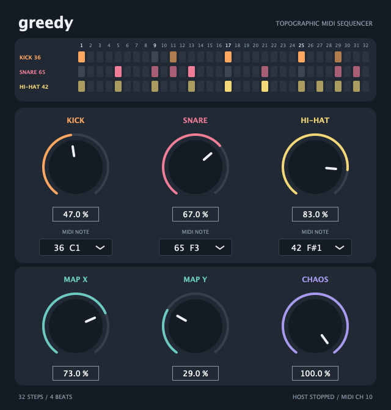

# Greedy

A JUCE VST3/AU MIDI drum sequencer based on Mutable Instruments Grids. It generates
MIDI notes only, with no audio input or output. Route its MIDI output to a drum
instrument in a host that supports MIDI output from VST3 plugins.



## Controls

- **Kick / Snare / Hi-Hat:** independent sequence density, from 0% (silent) to 100%.
- **MIDI Note:** configurable pitch (0–127) below each density knob. Defaults:
  kick 36, snare 38, hi-hat 42. Note numbers are authoritative; octave labels vary
  between hosts.
- **Map X / Map Y:** position in the original interpolated 5 × 5 Grids drum map.
- **Chaos:** increases per-part hit levels with a new perturbation each pattern.

All nine parameters support host automation and are saved with the project.
Double-click a knob to reset it. Knob values can also be typed directly.

The three pattern lanes show the 32 steps for kick, snare, and hi-hat, with their
assigned MIDI note numbers. Colored cells indicate active steps; brighter cells
indicate accents. A white outline follows the current step during playback.
The display updates with the density, map, and chaos controls and follows each
bar's chaos variation. When stopped, it previews the first bar.

The sequence has 32 thirty-second-note steps over four quarter-note beats (one
bar in 4/4). It follows the host tempo, playback position, and transport. All notes
use MIDI channel 10, a 10 ms duration, and velocity 90 or 120 for accented hits.
There is no internal clock: playback needs valid host BPM and PPQ information.
Stops, bypass, seeks, loop jumps, and note-mapping changes release active notes.
Parts assigned the same pitch combine coincident hits into one note.

## Build

Requires CMake 3.22+, a C++17 compiler, and JUCE's platform development dependencies.
CMake downloads JUCE **8.0.15** on the first configure. For an existing JUCE
checkout, add `-DGREEDY_JUCE_PATH=/path/to/JUCE` to the configure command.

```sh
cmake -S . -B build -DCMAKE_BUILD_TYPE=Release
cmake --build build --config Release --parallel 2
ctest --test-dir build --build-config Release --output-on-failure
```

The plugin is produced in `build/Greedy_artefacts/Release/VST3/Greedy.vst3`.
Copy that bundle into your host's VST3 folder and rescan plugins. Greedy is
declared as a MIDI effect with no audio buses; VST3 MIDI routing depends on the
host. It does not automatically install itself.

On macOS, the default formats are VST3 and AU. The AU MIDI effect is produced in
`build/Greedy_artefacts/Release/AU/Greedy.component`. Set
`-DCMAKE_OSX_ARCHITECTURES="arm64;x86_64" -DCMAKE_OSX_DEPLOYMENT_TARGET=11.0`
when configuring to build for both Apple Silicon and Intel Macs. Use
`-DGREEDY_PLUGIN_FORMATS=AU` to build only the AU format.

On Debian/Ubuntu, the required development packages can be installed with:

```sh
sudo apt-get install build-essential cmake ninja-build pkg-config \
  libfreetype-dev libfontconfig-dev libx11-dev libxext-dev \
  libxcomposite-dev libxcursor-dev libxinerama-dev libxrandr-dev libxrender-dev
```

To build and test the engine without JUCE or GUI libraries:

```sh
cmake -S . -B build-engine -DGREEDY_BUILD_PLUGIN=OFF
cmake --build build-engine
ctest --test-dir build-engine --output-on-failure
```

## Cross-compile for Windows from Linux

Install LLVM 19+ alongside the Linux JUCE build dependencies. On Debian/Ubuntu:

```sh
sudo apt-get install clang-19 clang-tools-19 lld-19 llvm-19
```

Install [xwin](https://github.com/Jake-Shadle/xwin) from its releases or with
`cargo install xwin --locked`. Use it to prepare the Windows SDK and MSVC CRT:

```sh
xwin --accept-license --manifest-version 17 splat --output /path/to/windows-sdk
```

That command accepts Microsoft's SDK/CRT licence. Keep xwin's default symlinks
enabled so Windows header casing works on Linux. The build uses Clang's MSVC
driver (`clang-cl`); JUCE 8.0.15 does not support MinGW.

Configure the Linux project with the SDK directory, then build `windows-vst3`:

```sh
cmake -S . -B build -DCMAKE_BUILD_TYPE=Release \
  -DGREEDY_WINDOWS_SDK_ROOT=/path/to/windows-sdk
cmake --build build --target windows-vst3
```

The target also creates `build/Greedy-Windows-x64.zip` for transfer to Windows.
Extract it into `C:\Program Files\Common Files\VST3` and rescan plugins.
The uncompressed 64-bit Windows bundle is in
`build/windows/Greedy_artefacts/Release/VST3/Greedy.vst3`. This is separate from
the Linux output in `build/Greedy_artefacts`; copy the entire Windows bundle,
including `Contents/x86_64-win/Greedy.vst3`.
The MSVC runtime is linked statically, so no Visual C++ runtime DLLs need to
accompany the bundle. The target uses a separate build tree and
reuses the Linux build's JUCE source checkout. Set `GREEDY_WINDOWS_BUILD_DIR` or
`GREEDY_WINDOWS_BUILD_JOBS` at configure time to change the output directory or
parallelism (default: two jobs).

JUCE's helper tools run natively on Linux, so the Linux GUI development libraries
are still required. Tests and automatic VST3 manifest generation are disabled in
this cross-build because Windows executables and plugins cannot run natively on
Linux. The optional manifest is not required for host scanning. Verify playback
and MIDI routing in a Windows DAW after building.

For a direct cross-build without configuring the Linux plugin first:

```sh
cmake -S . -B build-windows \
  -DCMAKE_TOOLCHAIN_FILE=cmake/toolchains/windows-clang.cmake \
  -DGREEDY_WINDOWS_SDK_ROOT=/path/to/windows-sdk \
  -DCMAKE_BUILD_TYPE=Release -DBUILD_TESTING=OFF
cmake --build build-windows --target Greedy_VST3 --parallel 2
```

## Cross-compile an AU for macOS from Linux

Install LLVM 19+ and the Linux JUCE build dependencies:

```sh
sudo apt-get install clang-19 clang-tools-19 lld-19 llvm-19
```

Provide a macOS SDK directory, such as `MacOSX14.5.sdk`. To extract an SDK from
Xcode or Command Line Tools, see the [OSXCross SDK packaging instructions](https://github.com/tpoechtrager/osxcross/blob/master/README.SDK.md).
The SDK is a build dependency and is not included in Greedy's sources or bundles.
This target uses LLVM directly; an OSXCross installation is not required.

```sh
cmake -S . -B build -DCMAKE_BUILD_TYPE=Release \
  -DGREEDY_MACOS_SDK_ROOT=/path/to/MacOSX14.5.sdk \
  -DGREEDY_MACOS_LLVM_ROOT=/usr/lib/llvm-19
cmake --build build --target macos-au
```

The target produces `build/Greedy-macOS-AU.zip`, containing `Greedy.component`.
Extract the component into `~/Library/Audio/Plug-Ins/Components` on the Mac and
restart the AU host. The uncompressed bundle is in
`build/macos/Greedy_artefacts/Release/AU/Greedy.component`.

By default the AU contains both Apple Silicon (`arm64`) and Intel (`x86_64`)
slices and targets macOS 11.0 or later. Set `GREEDY_MACOS_ARCHITECTURES`,
`GREEDY_MACOS_DEPLOYMENT_TARGET`, `GREEDY_MACOS_BUILD_DIR`, or
`GREEDY_MACOS_BUILD_JOBS` at configure time to customize these settings. LLVM
can also be found through `PATH` if `GREEDY_MACOS_LLVM_ROOT` is omitted.

Greedy is registered as an AU MIDI effect (`aumi`), with no audio buses. For
example, insert it in Logic's MIDI FX slot before a drum instrument. The linker
adds an ad-hoc code signature to each slice; this is not Developer ID signing or
notarization. Validation and DAW playback must be checked on macOS, for example:

```sh
auval -v aumi Grd1 Grdy
```

For a direct cross-build without configuring the Linux plugin first:

```sh
cmake -S . -B build-macos \
  -DCMAKE_TOOLCHAIN_FILE=cmake/toolchains/macos-clang.cmake \
  -DGREEDY_MACOS_SDK_ROOT=/path/to/MacOSX14.5.sdk \
  -DGREEDY_MACOS_LLVM_ROOT=/usr/lib/llvm-19 \
  -DGREEDY_PLUGIN_FORMATS=AU -DCMAKE_BUILD_TYPE=Release -DBUILD_TESTING=OFF
cmake --build build-macos --target Greedy_AU --parallel 2
```

## Source and attribution

`Source/DrumMaps.h` contains all 25 original 96-byte nodes, copied unchanged from
`../eurorack/grids/resources.cc`. `PatternEngine` ports the drum map ordering,
AVR interpolation rounding, density threshold, saturation, and accent threshold
from `../eurorack/grids/pattern_generator.cc`. AVR hardware, EEPROM, and interrupt
code are replaced with a host-synchronised MIDI scheduler and JUCE parameter state.

Chaos uses a deterministic cycle-derived random source instead of the original
AVR random generator. It gives each part one perturbation per 32-step pattern;
the same playback position and settings reproduce the same pattern regardless
of audio block size. Chaos changes apply immediately. The 4-beat pattern stays
the same length in other time signatures. Swing and Euclidean mode are not exposed.

Grids code and drum maps: copyright Emilie Gillet, GPL-3.0-or-later. Greedy source
is GPL-3.0-or-later; see `LICENSE`. JUCE is separately licensed under AGPLv3 or a
commercial JUCE licence; see the [JUCE licence](https://github.com/juce-framework/JUCE/blob/8.0.15/LICENSE.md).
